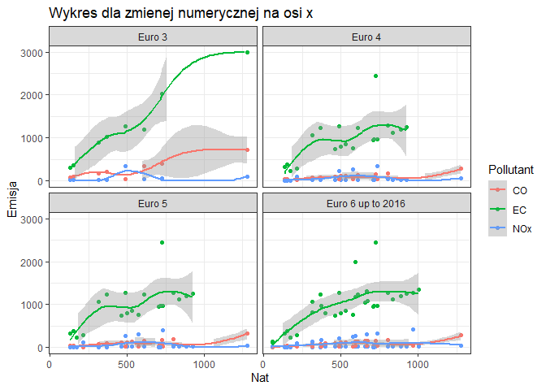

<!-- README.md is generated from README.Rmd. Please edit that file -->

# eeval

Pakiet utworzony w ramach przedmiotu Inwentaryzacja i Szacowanie
Emisji.  
Służy do obliczania emisji zanieczyszczeń generowanych przez pojazdy z
silnikami spalinowymi i wyświetlania wyników na wykresach.  
Funkcje korzystają z danych dołączonych do pakietu.  
Plik źródłowy z pierwotnymi danymi: `1.A.3.b.i-iv Road Transport
Appendix 4 Emission Factors 2019.xlsx` został wstępnie przetworzony i
zpisany do obiektu `wskazniki`.

Peny opis pakietu znajduje się na stronie
[RPubs](https://rpubs.com/rjakub/eeval_winieta)

## Instalacja z winietą

``` r
# W razie potrzeby trzeba zainstalować pakiet devtools
if (!require(devtools)) {install.packages("devtools"); require(devtools)}

# Instalacja z GitHub
install_github("rjakub999/eeval", force = T, build_vignettes = T)
library(eeval)
```

## Przykład zastosowania

``` r
library(eeval)
eeval_calc()
#>           Category          Fuel     Euro.Standard Technology Pollutant Mode
#> 1   Passenger Cars        Petrol            Euro 4        GDI        CO     
#> 2   Passenger Cars        Petrol            Euro 4        GDI        CO     
#> 3   Passenger Cars        Petrol            Euro 4        GDI       NOx     
#> 4   Passenger Cars        Petrol            Euro 4        GDI       NOx     
#> 5   Passenger Cars        Petrol            Euro 4        GDI        EC     
#> 6   Passenger Cars        Petrol            Euro 4        GDI        EC     
#> 7   Passenger Cars        Petrol            Euro 4        PFI        CO     
#> 8   Passenger Cars        Petrol            Euro 4        PFI        CO     
#> 9   Passenger Cars        Petrol            Euro 4        PFI       NOx     
#> 10  Passenger Cars        Petrol            Euro 4        PFI       NOx     
#> 11  Passenger Cars        Petrol            Euro 4        PFI        EC     
#> 12  Passenger Cars        Petrol            Euro 4        PFI        EC     
#> 13  Passenger Cars        Petrol            Euro 5        GDI        CO     
#> 14  Passenger Cars        Petrol            Euro 5        GDI        CO     
#> 15  Passenger Cars        Petrol            Euro 5        GDI       NOx     
#> 16  Passenger Cars        Petrol            Euro 5        GDI       NOx     
#> 17  Passenger Cars        Petrol            Euro 5        GDI        EC     
#> 18  Passenger Cars        Petrol            Euro 5        GDI        EC     
#> 19  Passenger Cars        Petrol            Euro 5        PFI        CO     
#> 20  Passenger Cars        Petrol            Euro 5        PFI        CO     
#> 21  Passenger Cars        Petrol            Euro 5        PFI       NOx     
#> 22  Passenger Cars        Petrol            Euro 5        PFI       NOx     
#> 23  Passenger Cars        Petrol            Euro 5        PFI        EC     
#> 24  Passenger Cars        Petrol            Euro 5        PFI        EC     
#> 25  Passenger Cars        Petrol Euro 6 up to 2016        GDI        CO     
#> 26  Passenger Cars        Petrol Euro 6 up to 2016        GDI        CO     
#> 27  Passenger Cars        Petrol Euro 6 up to 2016        GDI       NOx     
#> 28  Passenger Cars        Petrol Euro 6 up to 2016        GDI       NOx     
#> 29  Passenger Cars        Petrol Euro 6 up to 2016        GDI        EC     
#> 30  Passenger Cars        Petrol Euro 6 up to 2016        GDI        EC     
#> 31  Passenger Cars        Petrol Euro 6 up to 2016        PFI        CO     
#> 32  Passenger Cars        Petrol Euro 6 up to 2016        PFI        CO     
#> 33  Passenger Cars        Petrol Euro 6 up to 2016        PFI       NOx     
#> 34  Passenger Cars        Petrol Euro 6 up to 2016        PFI       NOx     
#> 35  Passenger Cars        Petrol Euro 6 up to 2016        PFI        EC     
#> 36  Passenger Cars        Petrol Euro 6 up to 2016        PFI        EC     
#> 37  Passenger Cars        Petrol Euro 6 up to 2016    GDI+GPF        CO     
#> 38  Passenger Cars        Petrol Euro 6 up to 2016    GDI+GPF        CO     
#> 39  Passenger Cars        Petrol Euro 6 up to 2016    GDI+GPF       NOx     
#> 40  Passenger Cars        Petrol Euro 6 up to 2016    GDI+GPF       NOx     
#> 41  Passenger Cars        Petrol Euro 6 up to 2016    GDI+GPF        EC     
#> 42  Passenger Cars        Petrol Euro 6 up to 2016    GDI+GPF        EC     
#> 43  Passenger Cars        Petrol            Euro 3        GDI        CO     
#> 44  Passenger Cars        Petrol            Euro 3        GDI       NOx     
#> 45  Passenger Cars        Petrol            Euro 3        GDI        EC     
#> 46  Passenger Cars        Petrol            Euro 4        GDI        CO     
#> 47  Passenger Cars        Petrol            Euro 4        GDI       NOx     
#> 48  Passenger Cars        Petrol            Euro 4        GDI        EC     
#> 49  Passenger Cars        Petrol            Euro 5        GDI        CO     
#> 50  Passenger Cars        Petrol            Euro 5        GDI       NOx     
#> 51  Passenger Cars        Petrol            Euro 5        GDI        EC     
#> 52  Passenger Cars        Petrol Euro 6 up to 2016        GDI        CO     
#> 53  Passenger Cars        Petrol Euro 6 up to 2016        GDI       NOx     
#> 54  Passenger Cars        Petrol Euro 6 up to 2016        GDI        EC     
#> 55  Passenger Cars        Petrol Euro 6 up to 2016    GDI+GPF        CO     
#> 56  Passenger Cars        Petrol Euro 6 up to 2016    GDI+GPF       NOx     
#> 57  Passenger Cars        Petrol Euro 6 up to 2016    GDI+GPF        EC     
#> 58  Passenger Cars        Petrol            Euro 3        GDI        CO     
#> 59  Passenger Cars        Petrol            Euro 3        GDI       NOx     
#> 60  Passenger Cars        Petrol            Euro 3        GDI        EC     
#> 61  Passenger Cars        Petrol            Euro 3        PFI        CO     
#> 62  Passenger Cars        Petrol            Euro 3        PFI        CO     
#> 63  Passenger Cars        Petrol            Euro 3        PFI       NOx     
#> 64  Passenger Cars        Petrol            Euro 3        PFI       NOx     
#> 65  Passenger Cars        Petrol            Euro 3        PFI        EC     
#> 66  Passenger Cars        Petrol            Euro 3        PFI        EC     
#> 67  Passenger Cars        Petrol            Euro 4        GDI        CO     
#> 68  Passenger Cars        Petrol            Euro 4        GDI       NOx     
#> 69  Passenger Cars        Petrol            Euro 4        GDI        EC     
#> 70  Passenger Cars        Petrol            Euro 4        PFI        CO     
#> 71  Passenger Cars        Petrol            Euro 4        PFI        CO     
#> 72  Passenger Cars        Petrol            Euro 4        PFI       NOx     
#> 73  Passenger Cars        Petrol            Euro 4        PFI       NOx     
#> 74  Passenger Cars        Petrol            Euro 4        PFI        EC     
#> 75  Passenger Cars        Petrol            Euro 4        PFI        EC     
#> 76  Passenger Cars        Petrol            Euro 5        GDI        CO     
#> 77  Passenger Cars        Petrol            Euro 5        GDI       NOx     
#> 78  Passenger Cars        Petrol            Euro 5        GDI        EC     
#> 79  Passenger Cars        Petrol            Euro 5        PFI        CO     
#> 80  Passenger Cars        Petrol            Euro 5        PFI        CO     
#> 81  Passenger Cars        Petrol            Euro 5        PFI       NOx     
#> 82  Passenger Cars        Petrol            Euro 5        PFI       NOx     
#> 83  Passenger Cars        Petrol            Euro 5        PFI        EC     
#> 84  Passenger Cars        Petrol            Euro 5        PFI        EC     
#> 85  Passenger Cars        Petrol Euro 6 up to 2016        GDI        CO     
#> 86  Passenger Cars        Petrol Euro 6 up to 2016        GDI       NOx     
#> 87  Passenger Cars        Petrol Euro 6 up to 2016        GDI        EC     
#> 88  Passenger Cars        Petrol Euro 6 up to 2016        PFI        CO     
#> 89  Passenger Cars        Petrol Euro 6 up to 2016        PFI        CO     
#> 90  Passenger Cars        Petrol Euro 6 up to 2016        PFI       NOx     
#> 91  Passenger Cars        Petrol Euro 6 up to 2016        PFI       NOx     
#> 92  Passenger Cars        Petrol Euro 6 up to 2016        PFI        EC     
#> 93  Passenger Cars        Petrol Euro 6 up to 2016        PFI        EC     
#> 94  Passenger Cars        Petrol            Euro 3        GDI        CO     
#> 95  Passenger Cars        Petrol            Euro 3        GDI        CO     
#> 96  Passenger Cars        Petrol            Euro 3        GDI       NOx     
#> 97  Passenger Cars        Petrol            Euro 3        GDI       NOx     
#> 98  Passenger Cars        Petrol            Euro 3        GDI        EC     
#> 99  Passenger Cars        Petrol            Euro 3        GDI        EC     
#> 100 Passenger Cars        Petrol            Euro 3        PFI        CO     
#> 101 Passenger Cars        Petrol            Euro 3        PFI       NOx     
#> 102 Passenger Cars        Petrol            Euro 3        PFI        EC     
#> 103 Passenger Cars        Petrol            Euro 4        GDI        CO     
#> 104 Passenger Cars        Petrol            Euro 4        GDI        CO     
#> 105 Passenger Cars        Petrol            Euro 4        GDI       NOx     
#> 106 Passenger Cars        Petrol            Euro 4        GDI       NOx     
#> 107 Passenger Cars        Petrol            Euro 4        GDI        EC     
#> 108 Passenger Cars        Petrol            Euro 4        GDI        EC     
#> 109 Passenger Cars        Petrol            Euro 4        PFI        CO     
#> 110 Passenger Cars        Petrol            Euro 4        PFI       NOx     
#> 111 Passenger Cars        Petrol            Euro 4        PFI        EC     
#> 112 Passenger Cars        Petrol            Euro 5        GDI        CO     
#> 113 Passenger Cars        Petrol            Euro 5        GDI        CO     
#> 114 Passenger Cars        Petrol            Euro 5        GDI       NOx     
#> 115 Passenger Cars        Petrol            Euro 5        GDI       NOx     
#> 116 Passenger Cars        Petrol            Euro 5        GDI        EC     
#> 117 Passenger Cars        Petrol            Euro 5        GDI        EC     
#> 118 Passenger Cars        Petrol            Euro 5        PFI        CO     
#> 119 Passenger Cars        Petrol            Euro 5        PFI       NOx     
#> 120 Passenger Cars        Petrol            Euro 5        PFI        EC     
#> 121 Passenger Cars        Petrol Euro 6 up to 2016        GDI        CO     
#> 122 Passenger Cars        Petrol Euro 6 up to 2016        GDI        CO     
#> 123 Passenger Cars        Petrol Euro 6 up to 2016        GDI       NOx     
#> 124 Passenger Cars        Petrol Euro 6 up to 2016        GDI       NOx     
#> 125 Passenger Cars        Petrol Euro 6 up to 2016        GDI        EC     
#> 126 Passenger Cars        Petrol Euro 6 up to 2016        GDI        EC     
#> 127 Passenger Cars        Petrol Euro 6 up to 2016        PFI        CO     
#> 128 Passenger Cars        Petrol Euro 6 up to 2016        PFI       NOx     
#> 129 Passenger Cars        Petrol Euro 6 up to 2016        PFI        EC     
#> 130 Passenger Cars        Petrol Euro 6 up to 2016    GDI+GPF        CO     
#> 131 Passenger Cars        Petrol Euro 6 up to 2016    GDI+GPF       NOx     
#> 132 Passenger Cars        Petrol Euro 6 up to 2016    GDI+GPF        EC     
#> 133 Passenger Cars        Diesel            Euro 4        DPF        CO     
#> 134 Passenger Cars        Diesel            Euro 4        DPF        CO     
#> 135 Passenger Cars        Diesel            Euro 4        DPF        CO     
#> 136 Passenger Cars        Diesel            Euro 4        DPF       NOx     
#> 137 Passenger Cars        Diesel            Euro 4        DPF       NOx     
#> 138 Passenger Cars        Diesel            Euro 4        DPF       NOx     
#> 139 Passenger Cars        Diesel            Euro 4        DPF        EC     
#> 140 Passenger Cars        Diesel            Euro 4        DPF        EC     
#> 141 Passenger Cars        Diesel            Euro 4        DPF        EC     
#> 142 Passenger Cars        Diesel            Euro 5        DPF        CO     
#> 143 Passenger Cars        Diesel            Euro 5        DPF        CO     
#> 144 Passenger Cars        Diesel            Euro 5        DPF        CO     
#> 145 Passenger Cars        Diesel            Euro 5        DPF       NOx     
#> 146 Passenger Cars        Diesel            Euro 5        DPF       NOx     
#> 147 Passenger Cars        Diesel            Euro 5        DPF       NOx     
#> 148 Passenger Cars        Diesel            Euro 5        DPF        EC     
#> 149 Passenger Cars        Diesel            Euro 5        DPF        EC     
#> 150 Passenger Cars        Diesel            Euro 5        DPF        EC     
#> 151 Passenger Cars        Diesel Euro 6 up to 2016        DPF        CO     
#> 152 Passenger Cars        Diesel Euro 6 up to 2016        DPF        CO     
#> 153 Passenger Cars        Diesel Euro 6 up to 2016        DPF        CO     
#> 154 Passenger Cars        Diesel Euro 6 up to 2016        DPF       NOx     
#> 155 Passenger Cars        Diesel Euro 6 up to 2016        DPF       NOx     
#> 156 Passenger Cars        Diesel Euro 6 up to 2016        DPF       NOx     
#> 157 Passenger Cars        Diesel Euro 6 up to 2016        DPF        EC     
#> 158 Passenger Cars        Diesel Euro 6 up to 2016        DPF        EC     
#> 159 Passenger Cars        Diesel Euro 6 up to 2016        DPF        EC     
#> 160 Passenger Cars        Diesel Euro 6 up to 2016    LNT+DPF        CO     
#> 161 Passenger Cars        Diesel Euro 6 up to 2016    LNT+DPF       NOx     
#> 162 Passenger Cars        Diesel Euro 6 up to 2016    LNT+DPF        EC     
#> 163 Passenger Cars        Diesel Euro 6 up to 2016    LNT+DPF        CO     
#> 164 Passenger Cars        Diesel Euro 6 up to 2016    LNT+DPF        CO     
#> 165 Passenger Cars        Diesel Euro 6 up to 2016    LNT+DPF        CO     
#> 166 Passenger Cars        Diesel Euro 6 up to 2016    LNT+DPF       NOx     
#> 167 Passenger Cars        Diesel Euro 6 up to 2016    LNT+DPF       NOx     
#> 168 Passenger Cars        Diesel Euro 6 up to 2016    LNT+DPF       NOx     
#> 169 Passenger Cars        Diesel Euro 6 up to 2016    LNT+DPF        EC     
#> 170 Passenger Cars        Diesel Euro 6 up to 2016    LNT+DPF        EC     
#> 171 Passenger Cars        Diesel Euro 6 up to 2016    LNT+DPF        EC     
#> 172 Passenger Cars        Diesel            Euro 3        DPF        CO     
#> 173 Passenger Cars        Diesel            Euro 3        DPF       NOx     
#> 174 Passenger Cars        Diesel            Euro 3        DPF        EC     
#> 175 Passenger Cars        Diesel            Euro 4        DPF        CO     
#> 176 Passenger Cars        Diesel            Euro 4        DPF       NOx     
#> 177 Passenger Cars        Diesel            Euro 4        DPF        EC     
#> 178 Passenger Cars        Diesel            Euro 5        DPF        CO     
#> 179 Passenger Cars        Diesel            Euro 5        DPF       NOx     
#> 180 Passenger Cars        Diesel            Euro 5        DPF        EC     
#> 181 Passenger Cars        Diesel Euro 6 up to 2016        DPF        CO     
#> 182 Passenger Cars        Diesel Euro 6 up to 2016        DPF       NOx     
#> 183 Passenger Cars        Diesel Euro 6 up to 2016        DPF        EC     
#> 184 Passenger Cars        Diesel Euro 6 up to 2016    LNT+DPF        CO     
#> 185 Passenger Cars        Diesel Euro 6 up to 2016    LNT+DPF        CO     
#> 186 Passenger Cars        Diesel Euro 6 up to 2016    LNT+DPF        CO     
#> 187 Passenger Cars        Diesel Euro 6 up to 2016    LNT+DPF       NOx     
#> 188 Passenger Cars        Diesel Euro 6 up to 2016    LNT+DPF       NOx     
#> 189 Passenger Cars        Diesel Euro 6 up to 2016    LNT+DPF       NOx     
#> 190 Passenger Cars        Diesel Euro 6 up to 2016    LNT+DPF        EC     
#> 191 Passenger Cars        Diesel Euro 6 up to 2016    LNT+DPF        EC     
#> 192 Passenger Cars        Diesel Euro 6 up to 2016    LNT+DPF        EC     
#> 193 Passenger Cars Petrol Hybrid            Euro 4        PFI        CO     
#> 194 Passenger Cars Petrol Hybrid            Euro 4        PFI        CO     
#> 195 Passenger Cars Petrol Hybrid            Euro 4        PFI       NOx     
#> 196 Passenger Cars Petrol Hybrid            Euro 4        PFI       NOx     
#> 197 Passenger Cars Petrol Hybrid            Euro 4        PFI        EC     
#> 198 Passenger Cars Petrol Hybrid            Euro 4        PFI        EC     
#> 199 Passenger Cars Petrol Hybrid            Euro 5        PFI        CO     
#> 200 Passenger Cars Petrol Hybrid            Euro 5        PFI        CO     
#> 201 Passenger Cars Petrol Hybrid            Euro 5        PFI       NOx     
#> 202 Passenger Cars Petrol Hybrid            Euro 5        PFI       NOx     
#> 203 Passenger Cars Petrol Hybrid            Euro 5        PFI        EC     
#> 204 Passenger Cars Petrol Hybrid            Euro 5        PFI        EC     
#> 205 Passenger Cars Petrol Hybrid Euro 6 up to 2016        PFI        CO     
#> 206 Passenger Cars Petrol Hybrid Euro 6 up to 2016        PFI        CO     
#> 207 Passenger Cars Petrol Hybrid Euro 6 up to 2016        PFI       NOx     
#> 208 Passenger Cars Petrol Hybrid Euro 6 up to 2016        PFI       NOx     
#> 209 Passenger Cars Petrol Hybrid Euro 6 up to 2016        PFI        EC     
#> 210 Passenger Cars Petrol Hybrid Euro 6 up to 2016        PFI        EC     
#> 211 Passenger Cars Petrol Hybrid            Euro 4        PFI        CO     
#> 212 Passenger Cars Petrol Hybrid            Euro 4        PFI       NOx     
#> 213 Passenger Cars Petrol Hybrid            Euro 4        PFI        EC     
#> 214 Passenger Cars Petrol Hybrid            Euro 5        PFI        CO     
#> 215 Passenger Cars Petrol Hybrid            Euro 5        PFI       NOx     
#> 216 Passenger Cars Petrol Hybrid            Euro 5        PFI        EC     
#> 217 Passenger Cars Petrol Hybrid Euro 6 up to 2016        PFI        CO     
#> 218 Passenger Cars Petrol Hybrid Euro 6 up to 2016        PFI       NOx     
#> 219 Passenger Cars Petrol Hybrid Euro 6 up to 2016        PFI        EC     
#> 220 Passenger Cars Petrol Hybrid Euro 6 up to 2016    GDI+GPF        CO     
#> 221 Passenger Cars Petrol Hybrid Euro 6 up to 2016    GDI+GPF       NOx     
#> 222 Passenger Cars Petrol Hybrid Euro 6 up to 2016    GDI+GPF        EC     
#> 223 Passenger Cars Petrol Hybrid            Euro 4        GDI        CO     
#> 224 Passenger Cars Petrol Hybrid            Euro 4        GDI       NOx     
#> 225 Passenger Cars Petrol Hybrid            Euro 4        GDI        EC     
#> 226 Passenger Cars Petrol Hybrid            Euro 4        PFI        CO     
#> 227 Passenger Cars Petrol Hybrid            Euro 4        PFI       NOx     
#> 228 Passenger Cars Petrol Hybrid            Euro 4        PFI        EC     
#> 229 Passenger Cars Petrol Hybrid            Euro 5        GDI        CO     
#> 230 Passenger Cars Petrol Hybrid            Euro 5        GDI       NOx     
#> 231 Passenger Cars Petrol Hybrid            Euro 5        GDI        EC     
#> 232 Passenger Cars Petrol Hybrid            Euro 5        PFI        CO     
#> 233 Passenger Cars Petrol Hybrid            Euro 5        PFI       NOx     
#> 234 Passenger Cars Petrol Hybrid            Euro 5        PFI        EC     
#> 235 Passenger Cars Petrol Hybrid Euro 6 up to 2016        GDI        CO     
#> 236 Passenger Cars Petrol Hybrid Euro 6 up to 2016        GDI       NOx     
#> 237 Passenger Cars Petrol Hybrid Euro 6 up to 2016        GDI        EC     
#> 238 Passenger Cars Petrol Hybrid Euro 6 up to 2016        PFI        CO     
#> 239 Passenger Cars Petrol Hybrid Euro 6 up to 2016        PFI       NOx     
#> 240 Passenger Cars Petrol Hybrid Euro 6 up to 2016        PFI        EC     
#> 241 Passenger Cars Petrol Hybrid            Euro 4        PFI        CO     
#> 242 Passenger Cars Petrol Hybrid            Euro 4        PFI       NOx     
#> 243 Passenger Cars Petrol Hybrid            Euro 4        PFI        EC     
#> 244 Passenger Cars Petrol Hybrid            Euro 5        PFI        CO     
#> 245 Passenger Cars Petrol Hybrid            Euro 5        PFI       NOx     
#> 246 Passenger Cars Petrol Hybrid            Euro 5        PFI        EC     
#> 247 Passenger Cars Petrol Hybrid Euro 6 up to 2016        PFI        CO     
#> 248 Passenger Cars Petrol Hybrid Euro 6 up to 2016        PFI       NOx     
#> 249 Passenger Cars Petrol Hybrid Euro 6 up to 2016        PFI        EC     
#>                 Segment        Nat      Emisja
#> 1                  Mini  461.55366  100.823115
#> 2                  Mini  496.55803  108.469572
#> 3                  Mini  461.55366   20.799956
#> 4                  Mini  496.55803   22.377431
#> 5                  Mini  461.55366  736.294060
#> 6                  Mini  496.55803  792.134830
#> 7                  Mini  802.02510  175.196680
#> 8                  Mini  529.73931  115.717785
#> 9                  Mini  802.02510   36.143332
#> 10                 Mini  529.73931   23.872749
#> 11                 Mini  802.02510 1279.431553
#> 12                 Mini  529.73931  845.067302
#> 13                 Mini  461.55366  114.135028
#> 14                 Mini  496.55803  122.791064
#> 15                 Mini  461.55366   11.356493
#> 16                 Mini  496.55803   12.217773
#> 17                 Mini  461.55366  736.294060
#> 18                 Mini  496.55803  792.134830
#> 19                 Mini  802.02510  198.328310
#> 20                 Mini  529.73931  130.996277
#> 21                 Mini  802.02510   19.733767
#> 22                 Mini  529.73931   13.034196
#> 23                 Mini  802.02510 1279.431553
#> 24                 Mini  529.73931  845.067302
#> 25                 Mini  461.55366  102.563808
#> 26                 Mini  496.55803  110.342279
#> 27                 Mini  461.55366   12.855780
#> 28                 Mini  496.55803   13.830766
#> 29                 Mini  461.55366  736.294060
#> 30                 Mini  496.55803  792.134830
#> 31                 Mini  802.02510  178.221419
#> 32                 Mini  529.73931  117.715632
#> 33                 Mini  802.02510   22.339024
#> 34                 Mini  529.73931   14.754973
#> 35                 Mini  802.02510 1279.431553
#> 36                 Mini  529.73931  845.067302
#> 37                 Mini  673.88501  149.746862
#> 38                 Mini  656.40671  145.862937
#> 39                 Mini  673.88501   18.769903
#> 40                 Mini  656.40671   18.283075
#> 41                 Mini  673.88501 1075.015908
#> 42                 Mini  656.40671 1047.133641
#> 43                Small  608.44541  340.419861
#> 44                Small  608.44541   43.246763
#> 45                Small  608.44541 1198.586896
#> 46                Small  608.44541  132.910573
#> 47                Small  608.44541   27.419646
#> 48                Small  608.44541 1223.893576
#> 49                Small  608.44541  150.459069
#> 50                Small  608.44541   14.970754
#> 51                Small  608.44541 1223.893576
#> 52                Small  608.44541  135.205250
#> 53                Small  608.44541   16.947196
#> 54                Small  608.44541 1223.893576
#> 55                Small  399.12393   88.691031
#> 56                Small  399.12393   11.116908
#> 57                Small  399.12393  802.841483
#> 58               Medium  153.05297   85.631790
#> 59               Medium  153.05297   10.878618
#> 60               Medium  153.05297  358.237634
#> 61               Medium 1280.60188  716.485500
#> 62               Medium  132.42335   74.089701
#> 63               Medium 1280.60188   91.021946
#> 64               Medium  132.42335    9.412317
#> 65               Medium 1280.60188 2997.392326
#> 66               Medium  132.42335  309.951704
#> 67               Medium  153.05297   33.433332
#> 68               Medium  153.05297    6.897345
#> 69               Medium  153.05297  376.271477
#> 70               Medium 1280.60188  279.738374
#> 71               Medium  132.42335   28.926939
#> 72               Medium 1280.60188   57.710436
#> 73               Medium  132.42335    5.967670
#> 74               Medium 1280.60188 3148.282396
#> 75               Medium  132.42335  325.554811
#> 76               Medium  153.05297   37.847614
#> 77               Medium  153.05297    3.765857
#> 78               Medium  153.05297  376.271477
#> 79               Medium 1280.60188  316.672890
#> 80               Medium  132.42335   32.746231
#> 81               Medium 1280.60188   31.509113
#> 82               Medium  132.42335    3.258267
#> 83               Medium 1280.60188 3148.282396
#> 84               Medium  132.42335  325.554811
#> 85               Medium  153.05297   34.010553
#> 86               Medium  153.05297    4.263026
#> 87               Medium  153.05297  376.271477
#> 88               Medium 1280.60188  284.568007
#> 89               Medium  132.42335   29.426358
#> 90               Medium 1280.60188   35.668953
#> 91               Medium  132.42335    3.688424
#> 92               Medium 1280.60188 3148.282396
#> 93               Medium  132.42335  325.554811
#> 94  Large-SUV-Executive  365.37845  204.426032
#> 95  Large-SUV-Executive  314.25216  175.821324
#> 96  Large-SUV-Executive  365.37845   25.970177
#> 97  Large-SUV-Executive  314.25216   22.336250
#> 98  Large-SUV-Executive  365.37845 1026.247012
#> 99  Large-SUV-Executive  314.25216  882.647414
#> 100 Large-SUV-Executive  723.57774  404.835390
#> 101 Large-SUV-Executive  723.57774   51.430078
#> 102 Large-SUV-Executive  723.57774 2032.329765
#> 103 Large-SUV-Executive  365.37845   79.814324
#> 104 Large-SUV-Executive  314.25216   68.646150
#> 105 Large-SUV-Executive  365.37845   16.465812
#> 106 Large-SUV-Executive  314.25216   14.161801
#> 107 Large-SUV-Executive  365.37845 1235.861801
#> 108 Large-SUV-Executive  314.25216 1062.931449
#> 109 Large-SUV-Executive  723.57774  158.060413
#> 110 Large-SUV-Executive  723.57774   32.608095
#> 111 Large-SUV-Executive  723.57774 2447.440719
#> 112 Large-SUV-Executive  365.37845   90.352397
#> 113 Large-SUV-Executive  314.25216   77.709663
#> 114 Large-SUV-Executive  365.37845    8.990109
#> 115 Large-SUV-Executive  314.25216    7.732151
#> 116 Large-SUV-Executive  365.37845 1235.861801
#> 117 Large-SUV-Executive  314.25216 1062.931449
#> 118 Large-SUV-Executive  723.57774  178.929501
#> 119 Large-SUV-Executive  723.57774   17.803576
#> 120 Large-SUV-Executive  723.57774 2447.440719
#> 121 Large-SUV-Executive  365.37845   81.192304
#> 122 Large-SUV-Executive  314.25216   69.831314
#> 123 Large-SUV-Executive  365.37845   10.176986
#> 124 Large-SUV-Executive  314.25216    8.752951
#> 125 Large-SUV-Executive  365.37845 1235.861801
#> 126 Large-SUV-Executive  314.25216 1062.931449
#> 127 Large-SUV-Executive  723.57774  160.789297
#> 128 Large-SUV-Executive  723.57774   20.154008
#> 129 Large-SUV-Executive  723.57774 2447.440719
#> 130 Large-SUV-Executive  591.09998  131.350849
#> 131 Large-SUV-Executive  591.09998   16.464069
#> 132 Large-SUV-Executive  591.09998 1999.345866
#> 133                Mini  214.48492   12.797324
#> 134                Mini  575.27458   34.323975
#> 135                Mini  733.57858   43.769243
#> 136                Mini  214.48492  101.022397
#> 137                Mini  575.27458  270.954326
#> 138                Mini  733.57858  345.515511
#> 139                Mini  214.48492  281.489046
#> 140                Mini  575.27458  754.987775
#> 141                Mini  733.57858  962.745237
#> 142                Mini  214.48492    8.534400
#> 143                Mini  575.27458   22.890297
#> 144                Mini  733.57858   29.189246
#> 145                Mini  214.48492  115.135634
#> 146                Mini  575.27458  308.807740
#> 147                Mini  733.57858  393.785423
#> 148                Mini  214.48492  281.489046
#> 149                Mini  575.27458  754.987775
#> 150                Mini  733.57858  962.745237
#> 151                Mini  214.48492   10.610616
#> 152                Mini  575.27458   28.458960
#> 153                Mini  733.57858   36.290294
#> 154                Mini  214.48492   94.836479
#> 155                Mini  575.27458  254.362943
#> 156                Mini  733.57858  324.358513
#> 157                Mini  214.48492  281.489046
#> 158                Mini  575.27458  754.987775
#> 159                Mini  733.57858  962.745237
#> 160                Mini  965.76711   47.776712
#> 161                Mini  965.76711  427.022806
#> 162                Mini  965.76711 1267.468421
#> 163               Small  595.90693   29.479647
#> 164               Small  668.40287   33.066037
#> 165               Small   54.78529    2.710240
#> 166               Small  595.90693  263.485728
#> 167               Small  668.40287  295.540472
#> 168               Small   54.78529   24.223820
#> 169               Small  595.90693 1167.931456
#> 170               Small  668.40287 1310.017875
#> 171               Small   54.78529  107.374931
#> 172 Large-SUV-Executive  488.54531   37.030948
#> 173 Large-SUV-Executive  488.54531  333.311028
#> 174 Large-SUV-Executive  488.54531 1269.933934
#> 175 Large-SUV-Executive  488.54531   29.149240
#> 176 Large-SUV-Executive  488.54531  230.104841
#> 177 Large-SUV-Executive  488.54531 1269.933934
#> 178 Large-SUV-Executive  488.54531   19.439321
#> 179 Large-SUV-Executive  488.54531  262.251416
#> 180 Large-SUV-Executive  488.54531 1269.933934
#> 181 Large-SUV-Executive  488.54531   24.168444
#> 182 Large-SUV-Executive  488.54531  216.014800
#> 183 Large-SUV-Executive  488.54531 1269.933934
#> 184 Large-SUV-Executive  373.78506   18.491229
#> 185 Large-SUV-Executive  315.25940   15.595952
#> 186 Large-SUV-Executive   54.40990    2.691670
#> 187 Large-SUV-Executive  373.78506  165.272501
#> 188 Large-SUV-Executive  315.25940  139.394841
#> 189 Large-SUV-Executive   54.40990   24.057839
#> 190 Large-SUV-Executive  373.78506  971.623969
#> 191 Large-SUV-Executive  315.25940  819.491250
#> 192 Large-SUV-Executive   54.40990  141.434135
#> 193                Mini  716.53254   24.747376
#> 194                Mini  707.20329   24.425166
#> 195                Mini  716.53254    9.529883
#> 196                Mini  707.20329    9.405804
#> 197                Mini  716.53254  963.704843
#> 198                Mini  707.20329  951.157420
#> 199                Mini  716.53254   24.747376
#> 200                Mini  707.20329   24.425166
#> 201                Mini  716.53254    9.529883
#> 202                Mini  707.20329    9.405804
#> 203                Mini  716.53254  963.704843
#> 204                Mini  707.20329  951.157420
#> 205                Mini  716.53254   24.747376
#> 206                Mini  707.20329   24.425166
#> 207                Mini  716.53254    9.529883
#> 208                Mini  707.20329    9.405804
#> 209                Mini  716.53254  963.704843
#> 210                Mini  707.20329  951.157420
#> 211               Small  173.91078    6.006476
#> 212               Small  173.91078    2.313013
#> 213               Small  173.91078  233.902372
#> 214               Small  173.91078    6.006476
#> 215               Small  173.91078    2.313013
#> 216               Small  173.91078  233.902372
#> 217               Small  173.91078    6.006476
#> 218               Small  173.91078    2.313013
#> 219               Small  173.91078  233.902372
#> 220               Small 1004.70058   34.700034
#> 221               Small 1004.70058   13.362518
#> 222               Small 1004.70058 1351.278225
#> 223              Medium  923.93110   31.910443
#> 224              Medium  923.93110   12.288284
#> 225              Medium  923.93110 1242.646822
#> 226              Medium  886.24932   30.609001
#> 227              Medium  886.24932   11.787116
#> 228              Medium  886.24932 1191.966474
#> 229              Medium  923.93110   31.910443
#> 230              Medium  923.93110   12.288284
#> 231              Medium  923.93110 1242.646822
#> 232              Medium  886.24932   30.609001
#> 233              Medium  886.24932   11.787116
#> 234              Medium  886.24932 1191.966474
#> 235              Medium  923.93110   31.910443
#> 236              Medium  923.93110   12.288284
#> 237              Medium  923.93110 1242.646822
#> 238              Medium  886.24932   30.609001
#> 239              Medium  886.24932   11.787116
#> 240              Medium  886.24932 1191.966474
#> 241 Large-SUV-Executive  836.07526   28.876105
#> 242 Large-SUV-Executive  836.07526   11.119801
#> 243 Large-SUV-Executive  836.07526 1124.484560
#> 244 Large-SUV-Executive  836.07526   28.876105
#> 245 Large-SUV-Executive  836.07526   11.119801
#> 246 Large-SUV-Executive  836.07526 1124.484560
#> 247 Large-SUV-Executive  836.07526   28.876105
#> 248 Large-SUV-Executive  836.07526   11.119801
#> 249 Large-SUV-Executive  836.07526 1124.484560
eeval_draw()
#> `geom_smooth()` using method = 'loess' and formula 'y ~ x'
#> Warning: Removed 3 rows containing non-finite values (stat_smooth).
#> Warning: Removed 3 rows containing missing values (geom_point).
#> Warning: Removed 67 rows containing missing values (geom_smooth).
#> Warning in max(ids, na.rm = TRUE): brak argumentów w max; zwracanie wartości -
#> Inf
```



## Podgląd winiety

``` r
# w przeglądarce
browseVignettes("eeval")

# w oknie pomocy
vignette("eeval")
```
